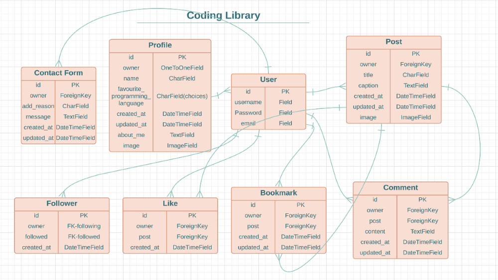
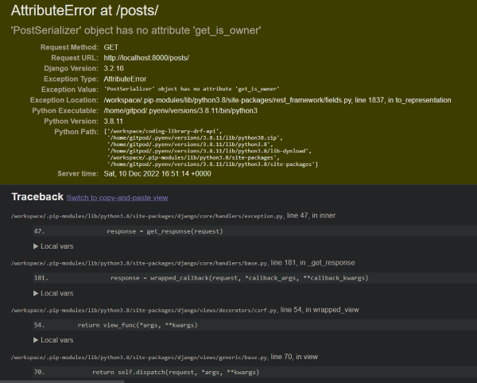
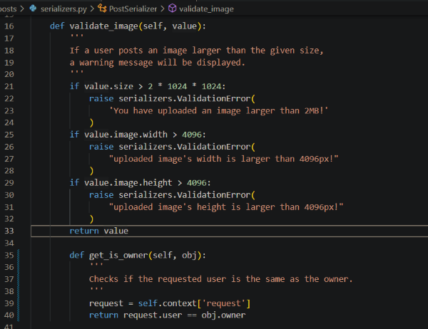
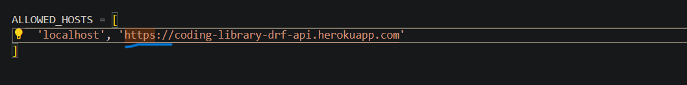
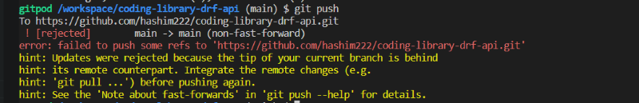
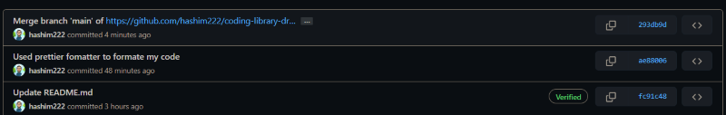

# Coding Library DRF-API - Backend

## Introduction

Coding Library Drf-Api is a back-end API created using Django Rest Framework that handles all backend functionality including user profiles, posts, comments, likes, bookmark posts, followers, authentication, authorization and more.

## Preview

- ### Live View For [Coding Library DRF-API ](https://coding-library-drf-api.herokuapp.com/)

- ### Github Repository For [Project5 Coding Library ](https://github.com/hashim222/p5-coding-library/)

- ### Live View For [Project5 Coding Library Frontend ](https://p5-coding-library.herokuapp.com/)

## Contents

- [Database Scheme](#database-scheme)

- [Testings](#testings)

- [Bugs](#bugs)

  - [Fixed Bugs](#fixed-bugs)
  - [Unfixed Bugs](#unfixed-bugs)

- [Technologies Used](#technologies-used)

  - [Language](#language)
  - [Framework](#frameworks)
  - [Libraries/Module Installed](#librariesmodule-installed)
  - [Other Technologies](#other-technologies)

- [Deployments](#deployments)

  - [Project Setup](#project-setup)
  - [JWT Tokens](#jwt-tokens)
  - [Heroku & ElephantSQL](#heroku--elephantsql)

- [Credits](#credits)
  - [Media](#media)
  - [Content](#content)

## Database Scheme

- To achieve a merit grade, I created a new `ContactForm` model based on a suggestion from my newly appointed mentor.
  

## Testings

- You can check what testing has been performed for the website by clicking [Testings.md](Testings.md).

## Bugs

- ### Fixed Bugs

  - In posts serializers, I encountered an issue where I was getting `PostSerializer object has no attribute get_is_owner` error, which turned out to be an indentation issue for the `get_is_owner` method.

    
    

  - During deployment on Heroku, I encountered another issue. Every time I ran my deployed site, I received a `Bad Request` error, which was caused by the unnecessary `https://` I added inside the `ALLOWED_HOSTS`. After I removed it, the site worked fine.

    
    

  - While making the readme documentation, I encountered a `faild to push` issue where I was unable to push my code, so I contacted tutor support and John helped me resolve the issue.

    
    

- ### Unfixed Bugs

  - So far none

## Technologies Used

- ### Language
  - [Python](https://www.python.org/)
- ### Frameworks

  - [Django REST framework](https://www.django-rest-framework.org/)
  - [Django](https://docs.djangoproject.com/en/4.1/)

- ### Libraries/Module Installed

  - asgiref==3.5.2
  - cloudinary==1.30.0
  - dj-database-url==0.5.0
  - dj-rest-auth==2.2.5
  - Django==3.2.16
  - django-allauth==0.50.0
  - django-cloudinary-storage==0.3.0
  - django-cors-headers==3.13.0
  - django-filter==22.1
  - djangorestframework==3.14.0
  - djangorestframework-simplejwt==5.2.2
  - gunicorn==20.1.0
  - oauthlib==3.2.2
  - Pillow==9.3.0
  - psycopg2==2.9.5
  - PyJWT==2.6.0
  - python3-openid==3.2.0
  - pytz==2022.6
  - requests-oauthlib==1.3.1
  - sqlparse==0.4.3

- ### Other Technologies
  - [Git](https://git-scm.com/)
  - [Github](https://github.com/)
  - [Gitpod](https://gitpod.io/workspaces)
  - [Heroku](https://dashboard.heroku.com/apps)
  - [Cloudinary](https://cloudinary.com/)
  - [Lucidchart](https://lucid.app/documents#/dashboard)
  - [CI Python Linter](https://pep8ci.herokuapp.com/)
  - [ElephantSQL](https://www.elephantsql.com/)
  - [Grammarly](https://www.grammarly.com/)

## Deployments

- ### Project Setup

  - Navigate the CI provided template repo on github and click on the `use this template` button and then press `create a new repository`.
  - Add your project name and then select `create a repository from template`.
  - After successfully creating a repo, you will see a green `gitpod` button, which by clicking creates a workspace for your project.
  - In the workspace using terminal add `pip3 install 'django<4'` to install django and also install Cloudinray storage and Pillow using `pip install django-cloudinary-storage`, `pip install Pillow`.
  - create your project name by using the `django-admin startproject your_proj_name .`
  - Make sure to add these on the `settings.py` file too,
    ```
    INSTALLED_APPS = [
      "cloudinary_storage",
      "django.contrib.staticfiles",
      "cloudinary",
      "your_proj_name"
    ]
    ```
  - Create an account with [cloudinary](https://cloudinary.com/) to save images there.
  - In order to protect my API keys from getting exposed, I need to create an env.py file in the top-level directory of my gitpod workspace and `import os`.
  - Go back to the Cloudinary website and click on the dashboard. Copy the URL from the `Paste your API Environment variable`.
  - Set the CLOUDINARY_URL in `env.py`,
    ```
    os.environ['CLOUDINARY_URL'] = 'cloudinary://<API Environment variable from cloudinary>'
    ```
  - In the `settings.py` file `import os` and below add:
    ```
    if os.path.exists('env.py'):
        import env
    ```
  - Set `CLOUDINARY_STORAGE` variable equals to the `CLOUDINARY_URL` variable,
    ```
    CLOUDINARY_STORAGE = {
      'CLOUDINARY_URL': os.environ.get('CLOUDINARY_URL')
    }
    ```
  - Define Media Storage URL
    `MEDIA_URL = '/media/'`
  - Define Default File Storage to Cloudinary
    ```
    DEFAULT_FILE_STORAGE = 'cloudinary_storage.storage.MediaCloudinaryStorage'
    ```
  - Use these commands to save everything on the Github
    ```
    git add .
    git commit -m "created my project and setup with cloudinary"
    git push
    ```

- ### JWT Tokens

  - Install JSON Web Token authentication using `pip install dj-rest-auth`.
  - Add both rest framework’s auth token and django rest auth to `settings.py` > `INSTALLED_APPS`
    ```
    INSTALLED_APPS = [
      'rest_framework.authtoken',
      'dj_rest_auth',
    ]
    ```
  - Add the urls to the `urlpatterns` list in the `your_proj_name` > `urls.py`.
    ```
    urlpatterns = [
      path('dj-rest-auth/', include('dj_rest_auth.urls')),
    ]
    ```
  - Migrate the database by using `python manage.py migrate`
  - Install Django all-Auth so users can be able to register `pip install 'dj-rest-auth[with_social]'`
  - Add the relevant apps to `INSTALLED_APPS`
    ```
    INSTALLED_APPS = [
      'django.contrib.sites',
      'allauth',
      'allauth.account',
      'allauth.socialaccount',
      'dj_rest_auth.registration',
    ]
    ```
  - Below `INSTALLED_APPS` list add `SITE_ID = 1`
  - Add the registration urls to the `urlpatterns` list in the `your_proj_name` > `urls.py`.

    ```
    urlpatterns = [
      path('dj-rest-auth/registration/', include('dj_rest_auth.registration.urls')),
    ]
    ```

  - To add JSON Web Tokens, install `pip install djangorestframework-simplejwt` into your terminal.

  - Back into the `env.py` create a session authentication value that differentiates between Development and Production mode `os.environ['DEV'] = '1'`
  - In the `settings.py` under the `SITE_ID = 1`

    ```
    ​​REST_FRAMEWORK = {
      'DEFAULT_AUTHENTICATION_CLASSES': [(
        'rest_framework.authentication.SessionAuthentication'
        if 'DEV' in os.environ
        else 'dj_rest_auth.jwt_auth.JWTCookieAuthentication'
      )]
    }
    ```

  - In order to enable jwt token, need to add these configs:

    ```
    REST_USE_JWT = True
    JWT_AUTH_COOKIE = 'my-app-auth'
    JWT_AUTH_SECURE = True
    JWT_AUTH_REFRESH_COOKIE = 'my-refresh-token'
    ```

  - Create a `serializers.py` in `your_proj_name` directory.

  - import these files:

    ```
    from dj_rest_auth.serializers import UserDetailsSerializer
    from rest_framework import serializers
    ```

  - Create the profile_id and profile_image fields

    ```
    class CurrentUserSerializer(UserDetailsSerializer):
      profile_id = serializers.ReadOnlyField(source='profile.id')
      profile_image = serializers.ReadOnlyField(source='profile.image.url')

      class Meta(UserDetailsSerializer.Meta):
          fields = UserDetailsSerializer.Meta.fields + ('profile_id', 'profile_image')
    ```

  - In `settings.py` file
    Overwrite the default `USER_DETAILS_SERIALIZER`
    Place under `JWT_AUTH_REFRESH_COOKIE = 'my-refresh-token'`

    ```
    REST_AUTH_SERIALIZERS = {'USER_DETAILS_SERIALIZER': 'your_proj_name.serializers.CurrentUserSerializer'}
    ```

  - Run migrations by using `python manage.py migrate`
  - Run `pip freeze > requirements.txt` to add all the install libraries into the `requirements.txt` file.
  - Run `git add`, `git commit`, `git push` commands to save all the changes into the github.

  - Create a `views.py` in the `your_proj_name` directory to add a custom message to the root_route.

  - Add the following code:

    ```
    from rest_framework.decorators import api_view
    from rest_framework.response import Response

    @api_view()
    def root_route(request):
        return Response({"message": "Welcome to my django rest framework API!"})
    ```

  - Add that to `urls.py` in `your_proj_name` directory.

    ```
    urlpatterns = [
      path('', root_route)
    ]
    ```

  - In `your_proj_name` > `settings.py` add the following code to setup site page pagination.
    ```
    REST_FRAMEWORK = {
      [...],
      'DEFAULT_PAGINATION_CLASS':  'rest_framework.pagination.PageNumberPagination',
      'PAGE_SIZE': 10,
    }
    ```
  - Set JSON Renderer if Dev environment is not present.

    ```
    if 'DEV' not in os.environ:
      REST_FRAMEWORK['DEFAULT_RENDERER_CLASSES'] = [
          'restframework.renderers.JSONRenderer'
      ]
    ```

  - It turns out that dj-rest-auth has a bug that doesn’t allow users to log out ref: [DRF Rest Auth Issues](https://github.com/iMerica/dj-rest-auth/issues/246). Follow the steps below to fix the bug.

  - In `your_proj_name` > `views.py` import all these jwt_auth from the settings:

    ```
    from .settings import (
      JWT_AUTH_COOKIE, JWT_AUTH_REFRESH_COOKIE, JWT_AUTH_SAMESITE,
      JWT_AUTH_SECURE,
    )
    ```

  - You will then need to add the following code:

    ```
    @api_view(['POST'])
    def logout_route(request):
      response = Response()
      response.set_cookie(
        key=JWT_AUTH_COOKIE,
        value='',
        httponly=True,
        expires='Thu, 01 Jan 1970 00:00:00 GMT',
        max_age=0,
        samesite=JWT_AUTH_SAMESITE,
        secure=JWT_AUTH_SECURE,
      )
      response.set_cookie(
        key=JWT_AUTH_REFRESH_COOKIE,
        value='',
        httponly=True,
        expires='Thu, 01 Jan 1970 00:00:00 GMT',
        max_age=0,
        samesite=JWT_AUTH_SAMESITE,
        secure=JWT_AUTH_SECURE,
      )
      return response
    ```

  - In the `your_proj_name` > `urls.py` import logout_route and then include it in the urlpatterns list. The important thing to note here is that our logout_route
    has to be placed above the default dj-rest-auth urls, so that it is matched first.

    ```
    from .views import root_route, logout_route

    urlpatterns = [
      path('dj-rest-auth/logout/', logout_route),
      path('dj-rest-auth/', include('dj_rest_auth.urls')),
    ]
    ```

  - Run `git add`, `git commit`, `git push` commands again to save all the changes into the github.

- ### Heroku & ElephantSQL

  - If you don't already have an account with [Heroku](https://id.heroku.com/login), create one.
  - Make a new app and name it something unique; choose a region that is close to you.
  - To get started, log into [ElephantSQL](https://www.elephantsql.com/) or create an account with them If you dont have one.
  - Give your plan a Name (this is commonly the name of the project)
  - Select the Tiny Turtle (Free) plan and you can leave the Tags field blank.
  - Select your nearest region.
  - Make sure your details are correct and click on `Create instance`.
  - Go back to the ElephantSQL dashboard and select the project's database name that you just created.
  - Copy your ElephantSQL database URL using the Copy icon. It will start with `postgres://`
  - In [Heroku](https://id.heroku.com/login) app, open the settings tab, and click on the `Reveal Config Vars`.
  - Add the `DATABASE_URL` key in the config var and the value should be the ElephantSQL database url you just copied.
  - Add the following extra libraries to the Gitpod workspace to make Heroku work:
    `pip install dj_database_url` and `pip install gunicorn`.
  - `Import dj_database_url` into `your_proj_name` > `settings.py`.

  - In `your_proj_name` > `settings.py` file add the following code to separate development and production environments:
    ```
    DATABASES = {
      'default': ({
        'ENGINE': 'django.db.backends.sqlite3',
        'NAME': BASE_DIR / 'db.sqlite3',
      } if 'DEV' in os.environ else dj_database_url.parse(
        os.environ.get('DATABASE_URL')
      ))
    }
    ```
  - To let Heroku know how to run the project, create a `Procfile` and add the following code:

    ```
    release: python manage.py makemigrations && python manage.py migrate

    web: gunicorn your_proj_name.wsgi
    ```

  - In `your_proj_name` > `settings.py` set `ALLOWED_HOSTS` = `['<yourherokuappname>.herokuapp.com', 'localhost']`.
  - In the terminal add `pip install django-cors-headers` to install CORS.
  - Go back to `your_proj_name` > `settings.py` add inside the `INSTALLED_APPS` and `MIDDLEWARE`:

    ```
    INSTALLED_APPS = [
      'corsheaders'
    ]

    MIDDLEWARE = [
      'corsheaders.middleware.CorsMiddleware'
    ]
    ```

  - For the network request made to the server add the following code:
    ```
    if 'CLIENT_ORIGIN' in os.environ:
      CORS_ALLOWED_ORIGINS = [
          os.environ.get('CLIENT_ORIGIN')
      ]
    else:
      CORS_ALLOWED_ORIGIN_REGEXES = [
          r"^https://.*\.gitpod\.io$",
      ]
    ```
  - To allow Cookies `CORS_ALLOW_CREDENTIALS = True`.
  - Allowing front-end apps and APIs to be deployed on different platforms add `JWT_AUTH_SAMESITE = 'None'`.

  - In the `env.py` file add your secret key `os.environ['SECRET_KEY'] = 'chooseanysecretkey'`.
  - In `your_proj_name` > `settings.py` file replace your insecure key with the one you just created `SECRET_KEY = os.getenv('SECRET_KEY')`

  - Replace the DEBUG Setting to True in Developments mode and False in Production modes.
    ```
    DEBUG = 'DEV' in os.environ
    ```
  - Copy the key and value of `SECRET_KEY` and `CLOUDINARY_URL` from `env.py` and add them to the Heroku config vars.

  - Before deploying to Github, update `requirements.txt` by adding `pip freeze > requirements.txt` command.

  - Run `git add`, `git commit`, `git push` commands again to save all the changes into the github.
  - Select the project repository name from Github, and connect.
  - In the Manual deploy section, choose the `main` Branch.
  - To view the app, click Open App once the deployment branch has been completed.

## Credits

- ### Media

  - Default images were taken from Code Institutes DRF-API walkthrough project.

- ### Content
  - I used the Code Institute's DRF-API walkthrough project as a guide to make this Backend API. Updates were also made.
  - All the codes have been credited.
  - Leah Fisher's [pp5-backend-DRF-the-winding-path](https://github.com/cornishcoder1/pp5-backend-DRF-the-winding-path) project provided insight into what needs to be added in my readme file.
  - Throughout the project, I received alot of assistance from tutor support.
  - [Grammarly](https://www.grammarly.com/) was used while creating the readme documentation to fix some grammar issues due to english being not my first language.
