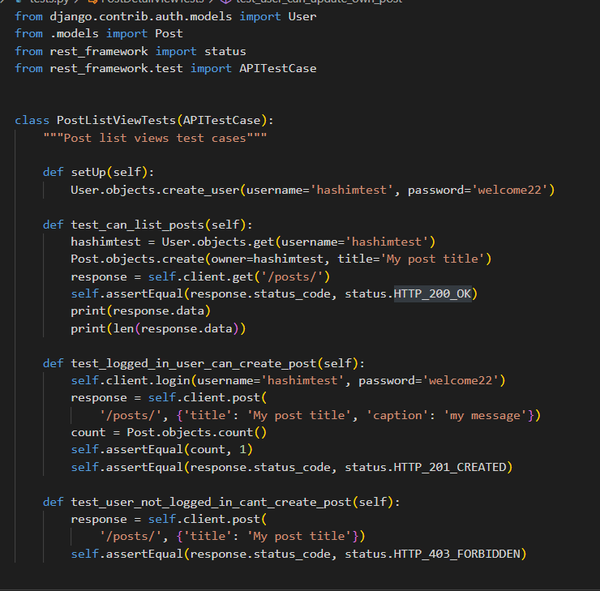
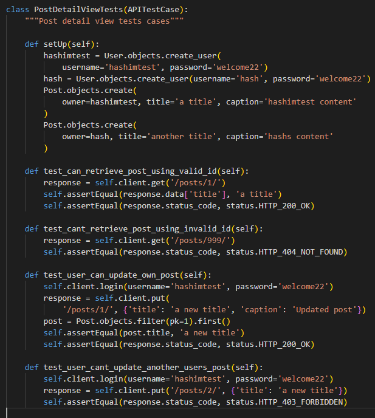
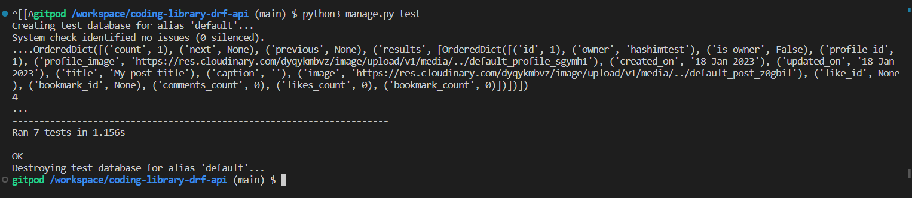
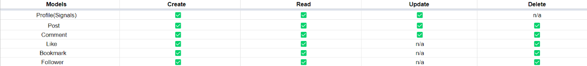

# Testings

## Automated Testings

- Unit testings in `posts` app.

  - ### PostListView Testcase

    

  - ### PostDetailView Testcase

    

  - ### Results for the testings

    

## URL Testings

- Both the development and deployed versions of each URL have been manually tested by adding all the `/profiles`, `/posts`, `/comments`, `/likes`, `/bookmarks`, and `/followers` next to url path one at a time to ensure everything is working.

  

## CRUD Functionality Testings

- Tested that users can search posts by post title or by the username of the posts owner.

- ### Development Testings

  - To test each crud functionality. I created two separate users and went through each url and their crud endpoints to test if everything was working as expected and everything was working fine.

- ### Deployed Testings

  - To test the deployed site, same steps were taken as development testing, only this time I had to use the Admin panel `https://coding-library-drf-api.herokuapp.com/admin/` to test all the crud functionalities.

  

  Additionally, frontend crud testing has been performed, which can be found on [Coding Library](https://github.com/hashim222/p5-coding-library) testings section.

## Code Validation

- This project has been run through the [Code Institutes python linter](https://pep8ci.herokuapp.com/) and [pylint](https://pypi.org/project/pylint/)(which was installed in the project) and found no errors or warnings except in the `settings.py` file long line which was related to built-in Django code.

  
  
