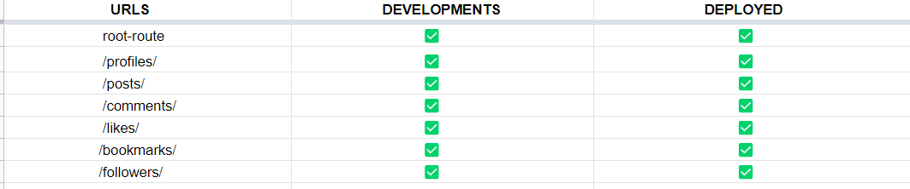
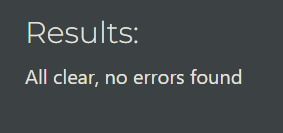
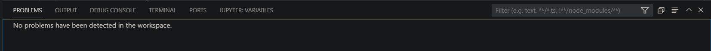

# Testings

* ### All aspects of this project were tested manually during development.

## URL Testings
* Each URL path has been manually tested in both the development and deployed versions, and everything works as expected. 

    

## CRUD Functionality Testings

## Code Validation
* This project has been run through the [Code Institutes python linter](https://pep8ci.herokuapp.com/) and [pylint](https://pypi.org/project/pylint/)(which was installed in the project) and found no errors or warnings except in the `settings.py` file long line which is built-in Django code.

    
    